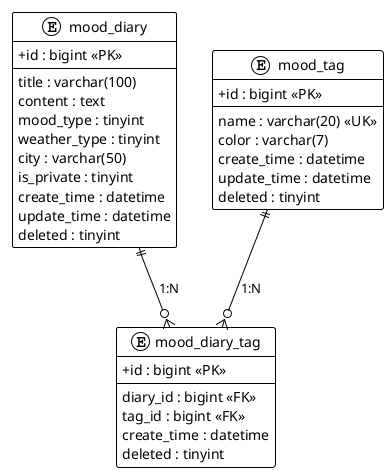

# MoodNote（晚风记事）项目工作流文档

***

## 一、项目背景

### 1.1 项目简介

MoodNote（晚风记事）是一个面向个人的轻量级心情日记记录 Web 应用。用户可以随时记录不同心情状态下的生活片段，通过标签进行分类整理，并通过集成的 AI 助手获得情感分析和写作建议。

### 1.2 项目定位

本项目定位为**学习型全栈练手项目**，核心目标：

- 通过一个功能简单但架构完整的应用，掌握 **Spring Boot 3（JDK 21）+ Vue 3** 全栈开发流程
- 体验多种中间件和技术栈在企业级项目中的实际应用
- 保持架构的可扩展性，为后续集成 **Spring AI Agent** 预留接口
- 适合初学者，但项目结构完善，能体现工程化思维

### 1.3 目标用户

- 希望记录每日心情与生活片段的个人用户
- 希望通过项目实践学习全栈开发的开发者

***

## 二、业务需求与功能规划

### 2.1 核心功能（V1.0 MVP）

#### 日记管理模块

| 功能   | 优先级 | 说明                           |
| ---- | --- | ---------------------------- |
| 创建日记 | P0  | 标题、正文内容、心情（emoji 选择）、天气、所在城市 |
| 编辑日记 | P0  | 修改已有日记的全部可编辑字段               |
| 删除日记 | P0  | 软删除机制，数据保留可恢复                |
| 日记列表 | P0  | 分页查询、支持按心情/日期范围/关键词/标签筛选     |
| 日记详情 | P0  | 单篇日记完整内容展示，含关联标签             |

#### 标签管理模块

| 功能   | 优先级 | 说明             |
| ---- | --- | -------------- |
| 创建标签 | P1  | 自定义标签名称与颜色     |
| 标签列表 | P1  | 查询所有可用标签       |
| 编辑标签 | P1  | 修改标签名称和颜色      |
| 删除标签 | P1  | 删除未被引用的标签      |
| 关联标签 | P1  | 日记创建/编辑时关联多个标签 |

#### 数据统计模块

| 功能   | 优先级 | 说明                |
| ---- | --- | ----------------- |
| 心情日历 | P2  | 月度日历热力图，按日期展示心情分布 |
| 情绪趋势 | P2  | 周/月维度的情绪统计折线图     |
| 标签统计 | P2  | 各标签使用频率统计         |

#### AI 助手模块（后续版本集成 Spring AI）

| 功能   | 优先级 | 说明                  |
| ---- | --- | ------------------- |
| 情感分析 | P2  | 对日记内容进行情感极性分析并返回置信度 |
| 写作建议 | P2  | 针对日记内容提供改进建议和润色方案   |
| 智能复盘 | P3  | Agent 多轮对话式周/月日记复盘  |

### 2.2 扩展规划（后续版本）

- **用户系统**：多用户注册登录、JWT 认证、权限管理
- **AI 增强**：Spring AI Agent 智能对话、日记自动标签推荐
- **数据同步**：WebSocket 实时同步多端数据
- **定时任务**：每日记录提醒推送（邮件/短信）
- **文件管理**：日记图片上传（MinIO/OSS）
- **搜索增强**：Elasticsearch 全文检索日记内容

### 2.3 登录功能（V1.0 MVP）

#### 用户认证模块

| 功能   | 优先级 | 说明                           |
| ---- | --- | ---------------------------- |
| 用户注册 | P0  | 用户名、密码、邮箱注册（需要邮箱验证码）        |
| 用户登录 | P0  | 用户名/邮箱、密码登录（需要图形验证码）        |
| 用户登出 | P0  | 退出登录，清除 token               |
| 密码重置 | P1  | 通过邮箱验证码重置密码                 |
| JWT 认证 | P0  | 使用 JWT 进行无状态身份认证           |
| 个人主页 | P0  | 显示用户基础信息和统计数据              |
| 邮箱验证码 | P0  | 使用 QQ 邮箱发送验证码                |
| 图形验证码 | P0  | 防止恶意调用接口                   |
| 权限控制 | P1  | 基于角色的权限管理（后续扩展）            |

***

## 三、项目工程结构

### 3.1 项目命名规范

| 项目     | 命名               | 说明                            |
| ------ | ---------------- | ----------------------------- |
| 项目总称   | moodnote         | 英文项目名                         |
| 后端父工程  | moodnote-parent  | Maven 父工程，统一依赖与模块管理           |
| 公共模块   | moodnote-common  | 通用工具类、全局异常、常量、配置              |
| 实体模块   | moodnote-pojo    | Entity、DTO、VO、Query 对象        |
| 数据访问模块 | moodnote-mapper  | Mapper 接口与 XML 映射文件           |
| 业务逻辑模块 | moodnote-service | Service 层接口与实现                |
| 启动模块   | moodnote-server  | Spring Boot 启动入口、Controller 层 |
| 前端工程   | moodnote-web     | Vue 3 前端项目                    |

### 3.2 后端 Maven 多模块结构及职责

```
moodnote-parent/
├── pom.xml # 父 POM：依赖管理、插件管理、模块聚合
│
├── moodnote-common/ # 公共模块
│ ├── config/ # 通用配置类
│ │ ├── JacksonConfig.java # JSON 序列化配置
│ │ ├── MyBatisPlusConfig.java # MyBatis-Plus 分页插件配置
│ │ └── ThreadPoolConfig.java # 线程池配置
│ ├── exception/ # 全局异常处理
│ │ ├── GlobalExceptionHandler.java # 全局异常处理器
│ │ ├── BusinessException.java # 业务异常类
│ │ └── ErrorCode.java # 错误码枚举
│ ├── constant/ # 常量与枚举
│ │ ├── MoodType.java # 心情类型枚举
│ │ └── WeatherType.java # 天气类型枚举
│ ├── annotation/ # 自定义注解
│ │ └── OperationLog.java # 操作日志注解
│ └── utils/ # 工具类
│ ├── Result.java # 统一返回结果封装
│ └── PageResult.java # 分页结果封装
│
├── moodnote-pojo/ # 实体与 DTO 模块
│ ├── entity/ # 数据库实体类
│ │ ├── BaseEntity.java # 实体基类（公共字段）
│ │ ├── Diary.java # 日记实体
│ │ ├── Tag.java # 标签实体
│ │ └── DiaryTag.java # 日记-标签关联实体
│ ├── dto/ # 数据传输对象
│ │ ├── DiaryCreateDTO.java # 创建日记请求体
│ │ ├── DiaryUpdateDTO.java # 更新日记请求体
│ │ ├── DiaryQueryDTO.java # 日记查询条件
│ │ └── TagCreateDTO.java # 创建标签请求体
│ └── vo/ # 视图对象（返回给前端）
│ ├── DiaryVO.java # 日记详情视图
│ ├── DiaryListVO.java # 日记列表项视图
│ ├── TagVO.java # 标签视图
│ └── MoodStatsVO.java # 心情统计视图
│
├── moodnote-mapper/ # 数据访问层模块
│ ├── mapper/ # Mapper 接口
│ │ ├── DiaryMapper.java # 日记 Mapper
│ │ ├── TagMapper.java # 标签 Mapper
│ │ └── DiaryTagMapper.java # 日记标签关联 Mapper
│ └── resources/mapper/ # XML 映射文件
│ ├── DiaryMapper.xml # 日记复杂 SQL
│ └── TagMapper.xml # 标签复杂 SQL
│
├── moodnote-service/ # 业务逻辑层模块
│ ├── service/ # Service 接口
│ │ ├── DiaryService.java # 日记业务接口
│ │ ├── TagService.java # 标签业务接口
│ │ └── StatsService.java # 统计业务接口
│ ├── service/impl/ # Service 实现类
│ │ ├── DiaryServiceImpl.java # 日记业务实现
│ │ ├── TagServiceImpl.java # 标签业务实现
│ │ └── StatsServiceImpl.java # 统计业务实现
│ └── converter/ # 对象转换器
│ ├── DiaryConverter.java # 日记对象 MapStruct 转换
│ └── TagConverter.java # 标签对象 MapStruct 转换
│
└── moodnote-server/ # 启动与 Web 层模块
├── controller/ # REST 控制器
│ ├── DiaryController.java # 日记接口
│ ├── TagController.java # 标签接口
│ └── StatsController.java # 统计接口
├── filter/ # 过滤器
│ └── RequestLogFilter.java # 请求日志过滤器
├── interceptor/ # 拦截器
│ └── ResponseAdvice.java # 统一响应拦截处理
├── MoodNoteApplication.java # Spring Boot 启动类
└── resources/
├── application.yml # 主配置文件
├── application-dev.yml # 开发环境配置
├── application-prod.yml # 生产环境配置
└── db/
└── schema.sql # 数据库初始化脚本
```

### 3.3 模块依赖关系

```
moodnote-server
↓ 依赖
moodnote-service
↓ 依赖
moodnote-mapper
↓ 依赖
moodnote-pojo

moodnote-common ←── 所有模块均依赖此模块
```

### 3.4 前端 Vue 3 目录结构

```
moodnote-web/
├── public/
│ └── favicon.ico
│
├── src/
│ ├── api/ # API 请求封装（按业务模块划分）
│ │ ├── diary.js # 日记相关 API
│ │ ├── tag.js # 标签相关 API
│ │ └── stats.js # 统计相关 API
│ │
│ ├── assets/ # 静态资源
│ │ ├── images/ # 图片资源
│ │ └── styles/ # 样式文件
│ │ ├── variables.scss # SCSS 变量定义
│ │ └── global.scss # 全局样式
│ │
│ ├── components/ # 组件
│ │ ├── common/ # 通用基础组件
│ │ │ ├── BaseButton.vue # 基础按钮
│ │ │ ├── BaseCard.vue # 基础卡片
│ │ │ ├── BaseModal.vue # 基础弹窗
│ │ │ └── BaseEmpty.vue # 空状态组件
│ │ ├── layout/ # 布局组件
│ │ │ ├── AppHeader.vue # 顶部导航栏
│ │ │ ├── AppSidebar.vue # 侧边栏
│ │ │ └── AppFooter.vue # 页脚
│ │ └── diary/ # 日记业务组件
│ │ ├── DiaryCard.vue # 日记卡片
│ │ ├── DiaryEditor.vue # 日记编辑器
│ │ ├── MoodSelector.vue # 心情选择器
│ │ └── TagSelector.vue # 标签选择器
│ │
│ ├── composables/ # 组合式函数（Hooks）
│ │ ├── useDiary.js # 日记相关逻辑
│ │ ├── useTag.js # 标签相关逻辑
│ │ └── useMood.js # 心情图标映射
│ │
│ ├── router/ # 路由配置
│ │ └── index.js # 路由定义
│ │
│ ├── stores/ # Pinia 状态管理
│ │ ├── diary.js # 日记状态
│ │ └── tag.js # 标签状态
│ │
│ ├── utils/ # 工具函数
│ │ ├── request.js # Axios 封装、拦截器
│ │ ├── emotion.js # 心情图标映射工具
│ │ └── date.js # 日期格式化工具
│ │
│ ├── views/ # 页面视图
│ │ ├── Home.vue # 首页（日记列表）
│ │ ├── DiaryDetail.vue # 日记详情页
│ │ ├── DiaryCreate.vue # 创建日记页
│ │ ├── DiaryEdit.vue # 编辑日记页
│ │ ├── StatsCalendar.vue # 心情日历页
│ │ └── StatsTrend.vue # 情绪趋势页
│ │
│ ├── App.vue # 根组件
│ └── main.js # 入口文件
│
├── .env.development # 开发环境变量
├── .env.production # 生产环境变量
├── vite.config.js # Vite 构建配置
├── package.json # 项目依赖配置
└── index.html # HTML 入口
```

***

## 四、数据库设计

### 4.1 数据库规范

- 数据库类型：MySQL 8.0+
- 字符集：utf8mb4，排序规则：utf8mb4\_unicode\_ci
- 所有表使用逻辑外键，不创建物理外键约束
- 所有表必须包含字段：`id`（主键）、`create_time`、`update_time`、`deleted`（软删除标记）
- 表名前缀统一为：`mood_`
- 主键策略：自增 ID（MySQL AUTO\_INCREMENT）
- 时间字段默认使用 `datetime` 类型

### 4.2 数据表设计

#### mood\_diary（日记表）

| 字段名           | 类型           | 约束                  | 说明                       |
| ------------- | ------------ | ------------------- | ------------------------ |
| id            | bigint       | PK, AUTO\_INCREMENT | 主键                       |
| title         | varchar(100) | NOT NULL            | 日记标题                     |
| content       | text         | NOT NULL            | 正文内容                     |
| mood\_type    | tinyint      | NOT NULL            | 心情类型：1开心/2平静/3难过/4焦虑/5生气 |
| weather\_type | tinyint      | NOT NULL            | 天气类型：1晴/2多云/3阴/4雨/5雪     |
| city          | varchar(50)  | DEFAULT NULL        | 所在城市                     |
| is\_private   | tinyint      | DEFAULT 1           | 是否私密：0公开/1私密             |
| create\_time  | datetime     | NOT NULL            | 创建时间                     |
| update\_time  | datetime     | NOT NULL            | 更新时间                     |
| deleted       | tinyint      | DEFAULT 0           | 软删除标记：0正常/1已删除           |

#### mood\_tag（标签表）

| 字段名          | 类型          | 约束                  | 说明         |
| ------------ | ----------- | ------------------- | ---------- |
| id           | bigint      | PK, AUTO\_INCREMENT | 主键         |
| name         | varchar(20) | NOT NULL, UNIQUE    | 标签名称       |
| color        | varchar(7)  | DEFAULT '#409EFF'   | 标签颜色（十六进制） |
| create\_time | datetime    | NOT NULL            | 创建时间       |
| update\_time | datetime    | NOT NULL            | 更新时间       |
| deleted      | tinyint     | DEFAULT 0           | 软删除标记      |

#### mood\_diary\_tag（日记-标签关联表）

| 字段名          | 类型       | 约束                  | 说明          |
| ------------ | -------- | ------------------- | ----------- |
| id           | bigint   | PK, AUTO\_INCREMENT | 主键          |
| diary\_id    | bigint   | NOT NULL            | 日记 ID（逻辑外键） |
| tag\_id      | bigint   | NOT NULL            | 标签 ID（逻辑外键） |
| create\_time | datetime | NOT NULL            | 创建时间        |
| deleted      | tinyint  | DEFAULT 0           | 软删除标记       |

### 4.3 UML 类图代码（PlantUML）

可使用以下 PlantUML 代码在 [PlantUML Online](https://www.plantuml.com/plantuml/uml/) 生成 ER 图：



## 五、技术栈与中间件

### 5.1 后端技术栈

| 技术                 | 版本          | 说明                   |
| ------------------ | ----------- | -------------------- |
| JDK                | 21          | Java 开发工具包（LTS 版本）   |
| Spring Boot        | 3.2.x       | 主框架                  |
| Spring MVC         | 内嵌          | Web 层框架              |
| MyBatis-Plus       | 3.5.x       | ORM 框架，增强 MyBatis    |
| MySQL              | 8.0+        | 关系型数据库               |
| Maven              | 3.9+        | 项目构建与依赖管理            |
| MapStruct          | 1.5.x       | 对象映射转换               |
| Jakarta Validation | 内嵌          | 参数校验                 |
| Lombok             | 1.18.x      | 代码简化                 |
| Knife4j            | 4.x         | API 文档生成（Swagger 增强） |
| Logback            | 内嵌          | 日志框架                 |
| Hutool             | 5.8.x       | Java 工具类库            |
| Spring AI          | 1.0.x（后续集成） | AI 框架集成              |

### 5.2 前端技术栈

| 技术         | 版本   | 说明          |
| ---------- | ---- | ----------- |
| Vue        | 3.4+ | 前端框架        |
| Vite       | 5.x  | 构建工具        |
| Vue Router | 4.x  | 路由管理        |
| Pinia      | 2.x  | 状态管理        |
| Axios      | 1.6+ | HTTP 请求库    |
| ECharts    | 5.x  | 数据可视化（统计图表） |
| Day.js     | 1.x  | 日期处理库       |
| SCSS       | -    | CSS 预处理器    |
| ESLint     | 8.x  | 代码规范检查      |

### 5.3 后续可集成中间件

| 中间件             | 用途            | 集成时机    |
| --------------- | ------------- | ------- |
| Redis           | 缓存、Session 管理 | 用户系统阶段  |
| Spring Security | 认证与授权         | 用户系统阶段  |
| JWT             | 无状态身份认证       | 用户系统阶段  |
| MinIO / 阿里云 OSS | 文件存储（图片上传）    | 文件管理阶段  |
| Elasticsearch   | 日记全文检索        | 搜索增强阶段  |
| RabbitMQ        | 异步消息（AI 分析回调） | AI 功能阶段 |
| Spring AI       | AI Agent 集成   | AI 功能阶段 |
| Docker          | 容器化部署         | 部署阶段    |

***

## 六、RESTful API 接口设计

### 6.1 接口规范

- 基础路径：`/api/v1`
- 请求方式：遵循 RESTful 风格
- 数据格式：JSON

**统一返回格式：**

```json
{
  "code": 200,
  "message": "操作成功",
  "data": {}
}
```

### 6.2 日记模块接口

| 方法 | 路径 | 说明 | 阶段 |
|------|------|------|------|
| POST | /api/v1/diaries | 创建日记 | 阶段一 |
| GET | /api/v1/diaries | 分页查询日记列表 | 阶段一 |
| GET | /api/v1/diaries/{id} | 查询日记详情 | 阶段一 |
| PUT | /api/v1/diaries/{id} | 更新日记 | 阶段一 |
| DELETE | /api/v1/diaries/{id} | 删除日记（软删除） | 阶段一 |

**查询参数（GET /api/v1/diaries）：**
| 参数 | 类型 | 必填 | 说明 |
|------|------|------|------|
| page | int | 否 | 页码，默认 1 |
| pageSize | int | 否 | 每页条数，默认 10 |
| moodType | int | 否 | 心情类型筛选 |
| startDate | string | 否 | 开始日期 |
| endDate | string | 否 | 结束日期 |
| keyword | string | 否 | 标题/内容关键词搜索 |
| tagId | int | 否 | 标签 ID 筛选 |

### 6.3 标签模块接口

| 方法 | 路径 | 说明 | 阶段 |
|------|------|------|------|
| POST | /api/v1/tags | 创建标签 | 阶段二 |
| GET | /api/v1/tags | 查询标签列表 | 阶段二 |
| PUT | /api/v1/tags/{id} | 更新标签 | 阶段二 |
| DELETE | /api/v1/tags/{id} | 删除标签 | 阶段二 |

### 6.4 统计模块接口

| 方法 | 路径 | 说明 | 阶段 |
|------|------|------|------|
| GET | /api/v1/stats/calendar | 心情日历数据 | 阶段三 |
| GET | /api/v1/stats/trend | 情绪趋势数据 | 阶段三 |
| GET | /api/v1/stats/tags | 标签使用统计 | 阶段三 |

**查询参数（GET /api/v1/stats/calendar）：**

| 参数 | 类型 | 必填 | 说明 |
|------|------|------|------|
| year | int | 是 | 年份 |
| month | int | 是 | 月份 |

**查询参数（GET /api/v1/stats/trend）：**

| 参数 | 类型 | 必填 | 说明 |
|------|------|------|------|
| type | string | 是 | 统计类型：week / month |
| date | string | 否 | 基准日期，默认当天 |

### 6.5 AI 模块接口（后续扩展）

| 方法 | 路径 | 说明 | 阶段 |
|------|------|------|------|
| POST | /api/v1/ai/analyze | 日记情感分析 | 后续 |
| POST | /api/v1/ai/suggest | 写作建议 | 后续 |
| POST | /api/v1/ai/chat | Agent 智能对话 | 后续 |

---

## 七、开发阶段规划

### 7.1 阶段一：项目初始化与环境搭建

- 创建 Maven 父工程与子模块
- 初始化 Vue 3 项目
- 配置基础依赖（pom.xml、package.json）
- 配置数据库连接
- 创建数据库表

### 7.2 阶段二：基础设施与日记 CRUD

- 全局异常处理
- 统一返回格式封装
- MyBatis-Plus 配置
- 跨域配置
- 日记实体、Mapper、Service、Controller 开发
- 前端日记列表与创建页面

### 7.4 阶段四：标签与关联功能

- 标签实体、Mapper、Service、Controller 开发
- 日记-标签关联功能
- 前端日记编辑与标签选择器组件

### 7.5 阶段五：数据统计与可视化

- 统计 Service 与 Controller 开发
- 前端 ECharts 心情日历与趋势图
- 标签使用统计

### 7.6 阶段六：优化与扩展

- API 文档生成（Knife4j）
- 参数校验完善
- 前端交互优化
- Docker 容器化（可选）
- Spring AI 集成（后续）

---

## 八、开发约定与规范

### 8.1 后端约定

- 类名使用大驼峰，方法名和变量名使用小驼峰
- 包名统一使用小写，以 `com.moodnote` 为基础路径
- Controller 类名以 `Controller` 结尾
- Service 接口以 `Service` 结尾，实现类以 `ServiceImpl` 结尾
- Mapper 接口以 `Mapper` 结尾
- 异常统一使用 `BusinessException` 抛出
- 日志使用 `@Slf4j` 注解，级别按场景选择

### 8.2 前端约定

- 组件名使用大驼峰（PascalCase）
- 文件名使用小驼峰（camelCase）或短横线（kebab-case）
- 使用 `<script setup>` 语法糖
- 组合式函数以 `use` 开头
- API 文件按业务模块命名
- 路由路径使用 kebab-case

### 8.3 Git 提交规范

| 前缀 | 说明 |
|------|------|
| feat | 新功能 |
| fix | 修复 Bug |
| refactor | 代码重构 |
| docs | 文档更新 |
| style | 代码格式调整 |
| chore | 构建/工具变动 |

---

## 九、可扩展性设计要点

1. **Service 层接口化**：所有业务逻辑定义接口，方便后续集成 AI 时增加实现类
2. **DTO/VO 分离**：输入输出对象独立，方便字段扩展
3. **配置外部化**：敏感信息与可变配置放入配置文件
4. **异常统一处理**：全局异常处理器预留 AI 异常类型
5. **API 版本化**：路径包含 `/v1`，方便后续版本迭代
6. **逻辑外键**：避免物理约束，方便后续分库分表
7. **模块解耦**：多模块结构便于后续微服务拆分

---

本文档为 MoodNote 项目的工作流总纲，后续将基于此文生成原子化的 Skills 指令文件，用于 Trae IDE 辅助编码。
```

