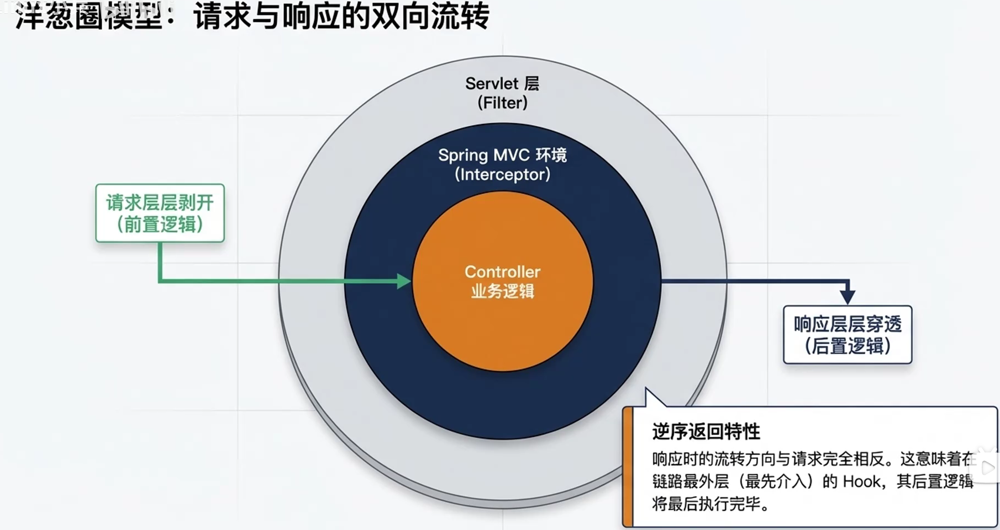
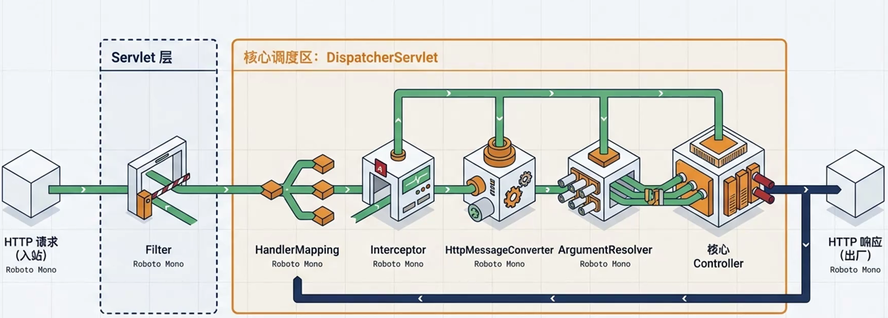
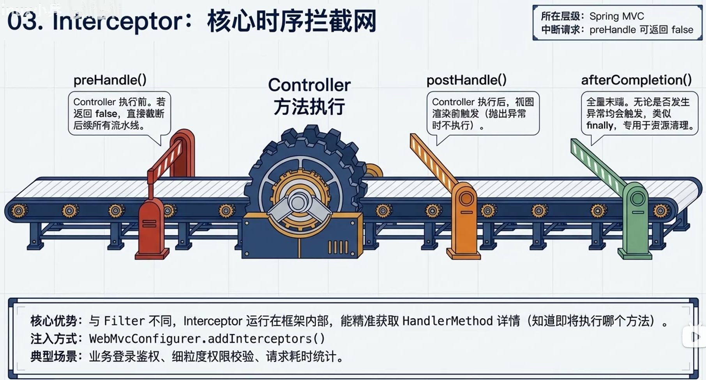
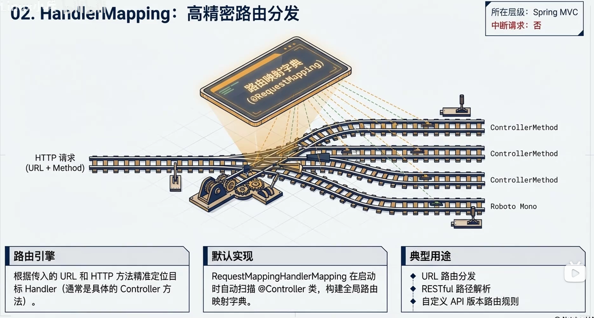
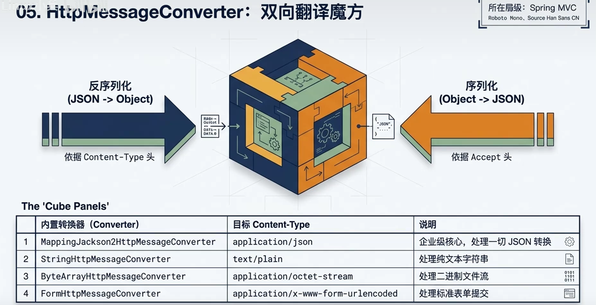
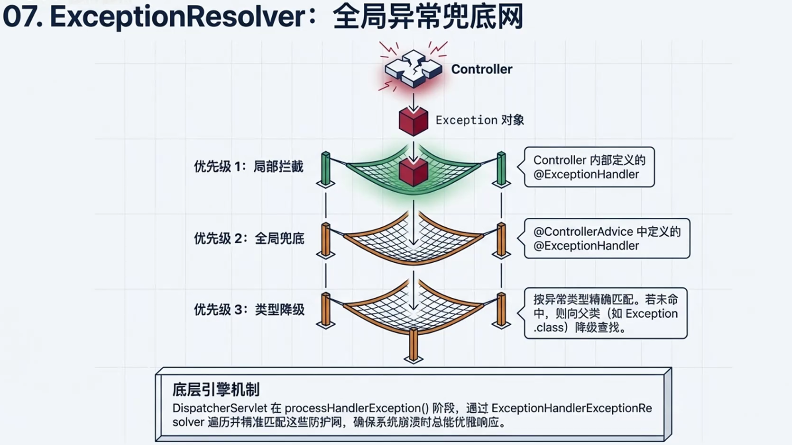
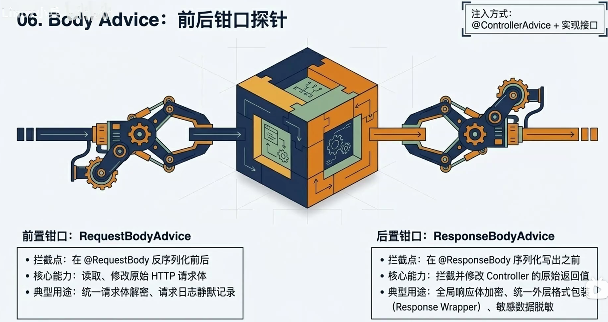
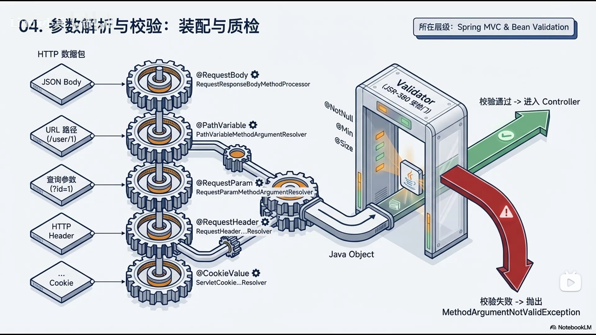
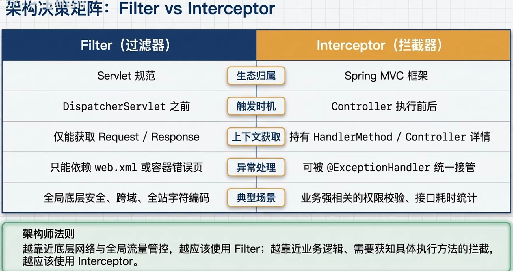
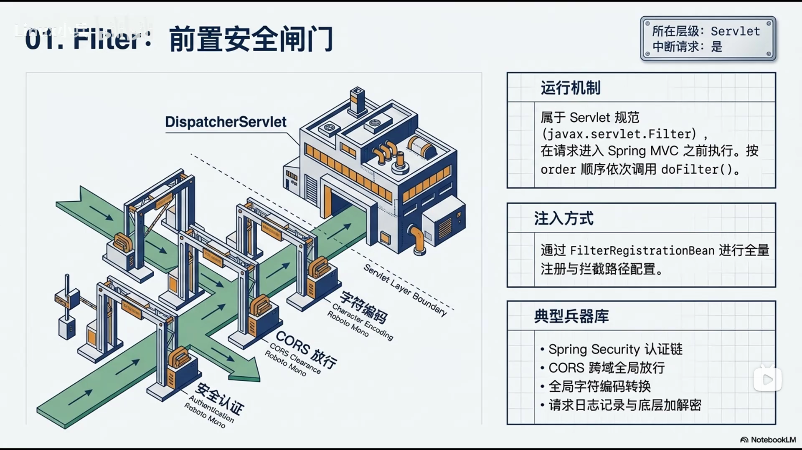

# Spring MVC 架构深度解析：Hook 机制与设计思想

---

## 一、Spring MVC 请求处理完整流程

### 1.1 架构层级总览

Spring MVC 的请求处理采用**洋葱圈模型**，请求从外向内层层穿透，响应从内向外层层返回。



**架构层次结构图：**

```
┌─────────────────────────────────────────────────────────────────────────┐
│                        请求入口 (Tomcat)                               │
└─────────────────────────────────────────────────────────────────────────┘
                                  │
                                  ▼
┌─────────────────────────────────────────────────────────────────────────┐
│                      第一层：Servlet Filter                            │
│   ┌──────────┐    ┌──────────┐    ┌──────────┐    ┌──────────┐        │
│   │  CORS    │──▶│ Security │──▶│   Auth   │──▶│   Log    │        │
│   │  Filter  │    │  Filter  │    │ Filter   │    │ Filter   │        │
│   └──────────┘    └──────────┘    └──────────┘    └──────────┘        │
└─────────────────────────────────────────────────────────────────────────┘
                                  │
                                  ▼
┌─────────────────────────────────────────────────────────────────────────┐
│                   第二层：DispatcherServlet                            │
│                    (Spring MVC 前端控制器)                              │
└─────────────────────────────────────────────────────────────────────────┘
                                  │
                                  ▼
┌─────────────────────────────────────────────────────────────────────────┐
│                   第三层：HandlerInterceptor                          │
│   ┌─────────────────────────────────────────────────────────────────┐   │
│   │  preHandle() ──▶ preHandle() ──▶ preHandle()                 │   │
│   │     │                  │                  │                   │   │
│   └─────────────────────────────────────────────────────────────────┘   │
│                              │                                         │
│                              ▼                                         │
│   ┌─────────────────────────────────────────────────────────────────┐   │
│   │                  Controller 执行                               │   │
│   └─────────────────────────────────────────────────────────────────┘   │
│                              │                                         │
│                              ▼                                         │
│   ┌─────────────────────────────────────────────────────────────────┐   │
│   │ postHandle() ◀── postHandle() ◀── postHandle()               │   │
│   │     │                  │                  │                   │   │
│   └─────────────────────────────────────────────────────────────────┘   │
│                              │                                         │
│                              ▼                                         │
│   ┌─────────────────────────────────────────────────────────────────┐   │
│   │afterCompletion() ◀──afterCompletion()◀──afterCompletion()    │   │
│   └─────────────────────────────────────────────────────────────────┘   │
└─────────────────────────────────────────────────────────────────────────┘
                                  │
                                  ▼
┌─────────────────────────────────────────────────────────────────────────┐
│                  第四层：Controller + HandlerMethod                    │
│    @GetMapping @PostMapping @PutMapping @DeleteMapping                │
└─────────────────────────────────────────────────────────────────────────┘
                                  │
                                  ▼
┌─────────────────────────────────────────────────────────────────────────┐
│                  响应处理：HttpMessageConverter                        │
│    @ResponseBody @RequestBody @ResponseEntity                        │
└─────────────────────────────────────────────────────────────────────────┘
                                  │
                                  ▼
┌─────────────────────────────────────────────────────────────────────────┐
│                  异常处理：HandlerExceptionResolver                     │
│    @ExceptionHandler @ControllerAdvice @RestControllerAdvice          │
└─────────────────────────────────────────────────────────────────────────┘
                                  │
                                  ▼
┌─────────────────────────────────────────────────────────────────────────┐
│                        响应返回 (Tomcat)                               │
└─────────────────────────────────────────────────────────────────────────┘
```

### 1.2 请求处理时序图

```
┌──────────┐     ┌───────────────┐     ┌─────────────────┐     ┌─────────────┐
│ Browser  │     │  FilterChain  │     │DispatcherServlet│     │Interceptor │
└────┬─────┘     └───────┬───────┘     └────────┬────────┘     └──────┬──────┘
     │                   │                       │                      │
     │─── GET /api/user ─▶│                       │                      │
     │                   │                       │                      │
     │            doFilter()                       │                      │
     │                   │───▶                    │                      │
     │                   │                       │                      │
     │                   │              getHandler()                     │
     │                   │                       │───▶                  │
     │                   │                       │                      │
     │                   │              HandlerInterceptor              │
     │                   │                       │                      │
     │                   │              preHandle() ✅                 │
     │                   │                       │───▶                  │
     │                   │                       │                      │
     │                   │                       │              preHandle() ✅
     │                   │                       │                      │───▶
     │                   │                       │                      │
     │                   │                       │              Controller
     │                   │                       │                      │
     │                   │                       │              @GetMapping
     │                   │                       │                      │
     │                   │                       │              postHandle()
     │                   │                       │◀───                  │
     │                   │                       │                      │
     │                   │                       │              afterCompletion()
     │                   │                       │◀───                  │
     │                   │                       │                      │
     │                   │◀───                    │                      │
     │                   │                       │                      │
     │◀── 200 OK ────────────────────────────────────────────────────────│
```

---

## 二、各层 Hook 详解

### 2.1 Servlet Filter（过滤器）

#### 2.1.1 概述

**位置**：Tomcat 容器层，在 Spring MVC 之前执行  
**作用**：处理所有 HTTP 请求，包括静态资源

Servlet Filter 是 Java EE 标准组件，运行在 Servlet 容器级别，是请求进入 Spring MVC 之前的第一道防线。

#### 2.1.2 核心特点

| 特性 | 说明 |
|------|------|
| **所属框架** | Servlet API（Java EE 标准） |
| **配置方式** | `@WebFilter` 或 `WebFilterRegistrationBean` |
| **作用范围** | 所有请求（包括静态资源、OPTIONS 预检请求） |
| **获取对象** | `HttpServletRequest`, `HttpServletResponse` |
| **典型用途** | CORS、字符编码、CSRF、安全认证、日志记录 |

#### 2.1.3 工作原理

Filter 的核心方法是 `doFilter()`，它接收三个参数：

```java
public void doFilter(ServletRequest request, ServletResponse response, FilterChain chain)
        throws IOException, ServletException;
```

**执行流程：**

1. **请求进入**：Filter 接收到请求
2. **预处理**：可以修改 request/response，进行认证、日志等操作
3. **传递请求**：调用 `chain.doFilter(request, response)` 将请求传递给下一个 Filter
4. **后处理**：在 `chain.doFilter()` 返回后，可以对响应进行处理

#### 2.1.4 常用 Filter 示例

```java
// 1. CORS Filter（跨域处理）
@WebFilter(urlPatterns = "/*")
public class CorsFilter implements Filter {
    
    @Override
    public void init(FilterConfig filterConfig) throws ServletException {
        // 初始化操作，只执行一次
        System.out.println("CorsFilter 初始化");
    }
    
    @Override
    public void doFilter(ServletRequest req, ServletResponse res, FilterChain chain) 
            throws IOException, ServletException {
        HttpServletRequest request = (HttpServletRequest) req;
        HttpServletResponse response = (HttpServletResponse) res;
        
        // 设置允许的来源
        response.setHeader("Access-Control-Allow-Origin", "*");
        // 设置允许的 HTTP 方法
        response.setHeader("Access-Control-Allow-Methods", "GET,POST,PUT,DELETE,OPTIONS");
        // 设置允许的请求头
        response.setHeader("Access-Control-Allow-Headers", "Content-Type,Authorization");
        // 设置预检请求的有效期（秒）
        response.setHeader("Access-Control-Max-Age", "3600");
        
        // 处理 OPTIONS 预检请求
        if ("OPTIONS".equalsIgnoreCase(request.getMethod())) {
            response.setStatus(HttpServletResponse.SC_OK);
            return;
        }
        
        // 继续执行后续过滤器
        chain.doFilter(request, response);
    }
    
    @Override
    public void destroy() {
        // 销毁操作，只执行一次
        System.out.println("CorsFilter 销毁");
    }
}

// 2. JWT 认证 Filter
@WebFilter(urlPatterns = "/api/*")
public class JwtAuthenticationFilter implements Filter {
    
    @Autowired
    private JwtTokenUtil jwtTokenUtil;
    
    @Autowired
    private RedisUtil redisUtil;
    
    // 白名单路径
    private static final Set<String> WHITE_LIST = Set.of(
        "/api/auth/login",
        "/api/auth/register",
        "/api/auth/captcha"
    );
    
    @Override
    public void doFilter(ServletRequest req, ServletResponse res, FilterChain chain) 
            throws IOException, ServletException {
        HttpServletRequest request = (HttpServletRequest) req;
        HttpServletResponse response = (HttpServletResponse) res;
        String uri = request.getRequestURI();
        
        // 白名单放行
        if (WHITE_LIST.contains(uri)) {
            chain.doFilter(request, response);
            return;
        }
        
        // 获取 Token
        String token = extractToken(request);
        
        if (token == null) {
            sendUnauthorizedResponse(response, "No token provided");
            return;
        }
        
        // 验证 Token
        try {
            if (!jwtTokenUtil.validateToken(token)) {
                sendUnauthorizedResponse(response, "Invalid token");
                return;
            }
            
            // 检查黑名单（用户登出时加入）
            String blackKey = "blacklist:token:" + token;
            if (redisUtil.hasKey(blackKey)) {
                sendUnauthorizedResponse(response, "Token has been invalidated");
                return;
            }
            
            // 将用户信息存入请求属性
            request.setAttribute("userId", jwtTokenUtil.extractUserId(token));
            request.setAttribute("username", jwtTokenUtil.extractUsername(token));
            
            // 放行
            chain.doFilter(request, response);
            
        } catch (Exception e) {
            sendUnauthorizedResponse(response, "Authentication failed");
        }
    }
    
    private String extractToken(HttpServletRequest request) {
        // 从 Header 获取
        String authHeader = request.getHeader("Authorization");
        if (authHeader != null && authHeader.startsWith("Bearer ")) {
            return authHeader.substring(7);
        }
        // 从 Cookie 获取
        Cookie[] cookies = request.getCookies();
        if (cookies != null) {
            for (Cookie cookie : cookies) {
                if ("token".equals(cookie.getName())) {
                    return cookie.getValue();
                }
            }
        }
        return null;
    }
    
    private void sendUnauthorizedResponse(HttpServletResponse response, String message) 
            throws IOException {
        response.setStatus(HttpServletResponse.SC_UNAUTHORIZED);
        response.setContentType("application/json;charset=UTF-8");
        response.getWriter().write("{\"code\":401,\"message\":\"" + message + "\"}");
    }
}
```

#### 2.1.5 Filter 在架构中的位置



**Filter 的优势**：
- **全局覆盖**：所有请求都经过 Filter，包括静态资源和 API 请求
- **性能优势**：在 Servlet 容器级别执行，比 Interceptor 更早
- **权限控制**：可以在请求到达 Spring MVC 之前进行认证

---

### 2.2 HandlerInterceptor（拦截器）

#### 2.2.1 概述

**位置**：Spring MVC 层，在 DispatcherServlet 之后、Controller 之前  
**作用**：对 Spring MVC 映射的请求进行拦截

Interceptor 是 Spring MVC 特有的组件，运行在 Spring 容器内部，可以访问 Spring 管理的 Bean。

#### 2.2.2 核心特点

| 特性 | 说明 |
|------|------|
| **所属框架** | Spring MVC |
| **配置方式** | `WebMvcConfigurer.addInterceptors()` |
| **作用范围** | 仅 `@RequestMapping` 映射的请求 |
| **获取对象** | `HandlerMethod`（包含方法签名、注解信息） |
| **典型用途** | 登录验证、权限校验、日志记录、性能监控 |

#### 2.2.3 拦截器生命周期

Interceptor 有三个核心方法，构成完整的拦截生命周期：

```java
public interface HandlerInterceptor {
    
    /**
     * Controller 执行前调用
     * @return true - 继续执行，false - 中断请求
     */
    default boolean preHandle(HttpServletRequest request, HttpServletResponse response, 
                            Object handler) throws Exception {
        return true;
    }
    
    /**
     * Controller 执行后、视图渲染前调用
     */
    default void postHandle(HttpServletRequest request, HttpServletResponse response,
                           Object handler, ModelAndView modelAndView) throws Exception {
    }
    
    /**
     * 整个请求完成后调用（无论成功失败）
     */
    default void afterCompletion(HttpServletRequest request, HttpServletResponse response,
                                Object handler, Exception ex) throws Exception {
    }
}
```

#### 2.2.4 生命周期详解

**1. preHandle() - 请求前置处理**

```java
@Override
public boolean preHandle(HttpServletRequest request, HttpServletResponse response, 
                        Object handler) throws Exception {
    // 1. 获取请求信息
    String uri = request.getRequestURI();
    String method = request.getMethod();
    
    // 2. 类型检查
    if (handler instanceof HandlerMethod) {
        HandlerMethod handlerMethod = (HandlerMethod) handler;
        // 获取方法信息
        Method methodObj = handlerMethod.getMethod();
        String methodName = methodObj.getName();
        // 获取方法上的注解
        RequiresPermission permission = methodObj.getAnnotation(RequiresPermission.class);
        if (permission != null) {
            // 检查权限
            if (!checkPermission(permission.value())) {
                response.setStatus(403);
                return false;
            }
        }
    }
    
    // 3. 记录开始时间（用于性能监控）
    request.setAttribute("startTime", System.currentTimeMillis());
    
    return true;
}
```

**2. postHandle() - 请求后置处理**

```java
@Override
public void postHandle(HttpServletRequest request, HttpServletResponse response,
                       Object handler, ModelAndView modelAndView) throws Exception {
    // 修改响应数据
    if (modelAndView != null) {
        // 添加通用数据
        modelAndView.addObject("systemTime", System.currentTimeMillis());
        modelAndView.addObject("appVersion", "1.0.0");
    }
    
    // 日志记录
    String uri = request.getRequestURI();
    log.info("请求处理完成: {}", uri);
}
```

**3. afterCompletion() - 请求完成处理**

```java
@Override
public void afterCompletion(HttpServletRequest request, HttpServletResponse response,
                            Object handler, Exception ex) throws Exception {
    // 计算执行时间
    long startTime = (Long) request.getAttribute("startTime");
    long endTime = System.currentTimeMillis();
    long duration = endTime - startTime;
    
    // 记录性能日志
    log.info("请求: {} 执行时间: {}ms", request.getRequestURI(), duration);
    
    // 清理资源
    request.removeAttribute("startTime");
    
    // 处理异常
    if (ex != null) {
        log.error("请求异常: {}", ex.getMessage(), ex);
    }
}
```

#### 2.2.5 完整示例：权限拦截器

```java
/**
 * 权限拦截器
 * 用于验证用户是否具有访问特定资源的权限
 */
@Component
public class PermissionInterceptor implements HandlerInterceptor {
    
    @Autowired
    private UserService userService;
    
    @Override
    public boolean preHandle(HttpServletRequest request, HttpServletResponse response,
                            Object handler) throws Exception {
        // 只拦截 Controller 方法
        if (!(handler instanceof HandlerMethod)) {
            return true;
        }
        
        HandlerMethod handlerMethod = (HandlerMethod) handler;
        
        // 检查类级别注解
        RequiresRole classRole = handlerMethod.getBeanType().getAnnotation(RequiresRole.class);
        // 检查方法级别注解
        RequiresRole methodRole = handlerMethod.getMethodAnnotation(RequiresRole.class);
        
        // 如果没有权限注解，直接放行
        if (classRole == null && methodRole == null) {
            return true;
        }
        
        // 获取当前用户
        Long userId = (Long) request.getAttribute("userId");
        if (userId == null) {
            response.sendRedirect("/login");
            return false;
        }
        
        User user = userService.findById(userId);
        if (user == null) {
            response.sendRedirect("/login");
            return false;
        }
        
        // 检查角色
        String requiredRole = methodRole != null ? methodRole.value() : classRole.value();
        if (!user.getRole().equals(requiredRole)) {
            response.setStatus(403);
            response.getWriter().write("{\"code\":403,\"message\":\"Permission denied\"}");
            return false;
        }
        
        return true;
    }
}

// 注册拦截器
@Configuration
public class WebMvcConfig implements WebMvcConfigurer {
    
    @Autowired
    private PermissionInterceptor permissionInterceptor;
    
    @Override
    public void addInterceptors(InterceptorRegistry registry) {
        registry.addInterceptor(permissionInterceptor)
                .addPathPatterns("/**")
                .excludePathPatterns(
                    "/login",
                    "/register",
                    "/static/**",
                    "/api/auth/**"
                );
    }
}
```

#### 2.2.6 拦截器时序图



---

### 2.3 HandlerMapping（处理器映射）

#### 2.3.1 概述

**位置**：DispatcherServlet 内部  
**作用**：根据请求 URL 匹配对应的 Controller 方法

HandlerMapping 是 DispatcherServlet 的核心组件，负责将请求 URL 映射到具体的处理器（Handler）。

#### 2.3.2 核心实现

| 实现类 | 说明 |
|--------|------|
| `RequestMappingHandlerMapping` | 处理 `@RequestMapping` 注解，最常用 |
| `SimpleUrlHandlerMapping` | 基于 URL 模式的简单映射 |
| `BeanNameUrlHandlerMapping` | 基于 Bean 名称的映射 |

#### 2.3.3 匹配流程

```java
// DispatcherServlet 内部逻辑简化版
protected HandlerExecutionChain getHandler(HttpServletRequest request) throws Exception {
    // 遍历所有 HandlerMapping
    for (HandlerMapping mapping : this.handlerMappings) {
        // 获取匹配的处理器执行链
        HandlerExecutionChain handler = mapping.getHandler(request);
        if (handler != null) {
            return handler;
        }
    }
    return null;
}
```

#### 2.3.4 请求匹配机制

**RequestMappingHandlerMapping 的匹配逻辑：**

1. **获取请求信息**：URL、HTTP 方法、请求头、请求参数
2. **遍历已注册的 HandlerMethod**：所有带有 `@RequestMapping` 注解的方法
3. **匹配条件**：
   - URL 路径匹配
   - HTTP 方法匹配（GET/POST/PUT/DELETE）
   - 请求头匹配（`@RequestMapping(headers = "Content-Type=application/json")`）
   - 请求参数匹配（`@RequestMapping(params = "action=delete")`）
4. **返回匹配结果**：返回 `HandlerExecutionChain`，包含 Handler 和 Interceptor 链

#### 2.3.5 匹配优先级

当多个 Handler 都能匹配同一个请求时，Spring MVC 按照以下优先级选择：

| 优先级 | 匹配类型 | 示例 |
|--------|----------|------|
| 1 | 精确匹配 | `/api/users/1` |
| 2 | 路径变量匹配 | `/api/users/{id}` |
| 3 | 通配符匹配 | `/api/users/*` |
| 4 | 模糊匹配 | `/api/**` |

#### 2.3.6 架构位置图



---

### 2.4 HttpMessageConverter（消息转换器）

#### 2.4.1 概述

**位置**：Controller 层  
**作用**：实现请求体/响应体的序列化与反序列化

HttpMessageConverter 负责在 Java 对象和 HTTP 请求/响应体之间进行转换。

#### 2.4.2 常用转换器

| 转换器 | 说明 | 支持的媒体类型 |
|--------|------|---------------|
| `MappingJackson2HttpMessageConverter` | JSON 序列化（Jackson） | `application/json` |
| `StringHttpMessageConverter` | 字符串处理 | `text/plain` |
| `FormHttpMessageConverter` | 表单数据处理 | `application/x-www-form-urlencoded` |
| `ByteArrayHttpMessageConverter` | 字节数组处理 | `application/octet-stream` |
| `ResourceHttpMessageConverter` | 资源文件处理 | 多种媒体类型 |
| `SourceHttpMessageConverter` | XML 处理 | `application/xml` |

#### 2.4.3 工作原理

**请求体转换（@RequestBody）：**

```java
// 请求：POST /api/users
// Content-Type: application/json
// Body: {"username":"alex","email":"alex@example.com"}

@PostMapping("/users")
public ResponseEntity<User> createUser(@RequestBody UserCreateDTO dto) {
    // HttpMessageConverter 将 JSON 转换为 UserCreateDTO 对象
    User user = userService.create(dto);
    return ResponseEntity.ok(user);
}
```

**响应体转换（@ResponseBody）：**

```java
@GetMapping("/users/{id}")
public User getUser(@PathVariable Long id) {
    User user = userService.findById(id);
    // HttpMessageConverter 将 User 对象转换为 JSON
    return user;
}
```

#### 2.4.4 自定义转换器

```java
/**
 * 自定义消息转换器示例
 * 用于处理自定义的数据格式
 */
@Component
public class CustomMessageConverter extends AbstractHttpMessageConverter<CustomData> {
    
    public CustomMessageConverter() {
        // 设置支持的媒体类型
        super(new MediaType("application", "x-custom"));
    }
    
    @Override
    protected boolean supports(Class<?> clazz) {
        return CustomData.class.isAssignableFrom(clazz);
    }
    
    @Override
    protected CustomData readInternal(Class<? extends CustomData> clazz, 
                                     HttpInputMessage inputMessage) 
            throws IOException, HttpMessageNotReadableException {
        // 从输入流读取并转换
        String content = StreamUtils.copyToString(inputMessage.getBody(), StandardCharsets.UTF_8);
        return parseCustomFormat(content);
    }
    
    @Override
    protected void writeInternal(CustomData data, HttpOutputMessage outputMessage) 
            throws IOException, HttpMessageNotWritableException {
        // 将对象转换为自定义格式并写入输出流
        String content = formatCustomData(data);
        outputMessage.getBody().write(content.getBytes(StandardCharsets.UTF_8));
    }
}
```

#### 2.4.5 架构位置图



---

### 2.5 HandlerExceptionResolver（异常解析器）

#### 2.5.1 概述

**位置**：响应处理层  
**作用**：统一处理 Controller 抛出的异常

ExceptionResolver 负责捕获 Controller 执行过程中抛出的异常，并转换为统一的响应格式。

#### 2.5.2 核心实现

| 实现类 | 说明 |
|--------|------|
| `ExceptionHandlerExceptionResolver` | 处理 `@ExceptionHandler` 注解 |
| `ResponseStatusExceptionResolver` | 处理 `@ResponseStatus` 注解 |
| `DefaultHandlerExceptionResolver` | 处理 Spring MVC 内置异常 |

#### 2.5.3 统一异常处理示例

```java
/**
 * 全局异常处理器
 * 使用 @RestControllerAdvice 统一处理所有 Controller 的异常
 */
@RestControllerAdvice
public class GlobalExceptionHandler {
    
    private static final Logger log = LoggerFactory.getLogger(GlobalExceptionHandler.class);
    
    /**
     * 处理业务异常
     */
    @ExceptionHandler(BusinessException.class)
    public ResponseEntity<Result<Void>> handleBusinessException(BusinessException e) {
        log.warn("业务异常: {}", e.getMessage());
        return ResponseEntity
                .status(e.getErrorCode().getStatus())
                .body(Result.error(e.getErrorCode(), e.getMessage()));
    }
    
    /**
     * 处理参数校验异常
     */
    @ExceptionHandler(MethodArgumentNotValidException.class)
    public ResponseEntity<Result<Void>> handleValidationException(
            MethodArgumentNotValidException e) {
        StringBuilder message = new StringBuilder("参数校验失败: ");
        e.getBindingResult().getFieldErrors().forEach(error -> {
            message.append(error.getField())
                   .append(" ")
                   .append(error.getDefaultMessage())
                   .append("; ");
        });
        log.warn("参数校验异常: {}", message);
        return ResponseEntity.badRequest().body(Result.error(message.toString()));
    }
    
    /**
     * 处理参数绑定异常
     */
    @ExceptionHandler(BindException.class)
    public ResponseEntity<Result<Void>> handleBindException(BindException e) {
        String message = e.getBindingResult().getFieldError().getDefaultMessage();
        log.warn("参数绑定异常: {}", message);
        return ResponseEntity.badRequest().body(Result.error(message));
    }
    
    /**
     * 处理资源未找到异常
     */
    @ExceptionHandler(ResourceNotFoundException.class)
    public ResponseEntity<Result<Void>> handleResourceNotFoundException(
            ResourceNotFoundException e) {
        log.warn("资源未找到: {}", e.getMessage());
        return ResponseEntity.status(404).body(Result.error(e.getMessage()));
    }
    
    /**
     * 处理认证异常
     */
    @ExceptionHandler(AuthenticationException.class)
    public ResponseEntity<Result<Void>> handleAuthenticationException(
            AuthenticationException e) {
        log.warn("认证失败: {}", e.getMessage());
        return ResponseEntity.status(401).body(Result.error("认证失败，请重新登录"));
    }
    
    /**
     * 处理授权异常
     */
    @ExceptionHandler(AuthorizationException.class)
    public ResponseEntity<Result<Void>> handleAuthorizationException(
            AuthorizationException e) {
        log.warn("授权失败: {}", e.getMessage());
        return ResponseEntity.status(403).body(Result.error("无权限访问"));
    }
    
    /**
     * 处理未知异常
     */
    @ExceptionHandler(Exception.class)
    public ResponseEntity<Result<Void>> handleException(Exception e) {
        log.error("系统异常", e);
        // 生产环境不返回详细错误信息
        return ResponseEntity.status(500)
                .body(Result.error("系统内部错误，请稍后重试"));
    }
}
```

#### 2.5.4 Controller 级别异常处理

```java
@RestController
@RequestMapping("/users")
public class UserController {
    
    @Autowired
    private UserService userService;
    
    @GetMapping("/{id}")
    public ResponseEntity<User> getUser(@PathVariable Long id) {
        User user = userService.findById(id);
        if (user == null) {
            throw new ResourceNotFoundException("用户不存在，ID: " + id);
        }
        return ResponseEntity.ok(user);
    }
    
    /**
     * 仅处理本 Controller 的异常
     */
    @ExceptionHandler(ResourceNotFoundException.class)
    public ResponseEntity<Result<Void>> handleResourceNotFound(
            ResourceNotFoundException e) {
        return ResponseEntity.status(404).body(Result.error(e.getMessage()));
    }
}
```

#### 2.5.5 架构位置图



---

### 2.6 RequestBodyAdvice / ResponseBodyAdvice（请求/响应增强）

#### 2.6.1 概述

**位置**：消息转换前后  
**作用**：在序列化/反序列化前后进行增强处理

BodyAdvice 允许在不修改 Controller 的情况下，对请求体和响应体进行统一处理。

#### 2.6.2 RequestBodyAdvice（请求体增强）

```java
/**
 * 请求体解密增强器
 * 对带有 @Encrypted 注解的参数进行解密处理
 */
@ControllerAdvice
public class RequestBodyDecryptAdvice implements RequestBodyAdvice {
    
    @Autowired
    private EncryptionService encryptionService;
    
    @Override
    public boolean supports(MethodParameter methodParameter, Type targetType,
                          Class<? extends HttpMessageConverter<?>> converterType) {
        // 只对带有 @Encrypted 注解的参数进行处理
        return methodParameter.hasParameterAnnotation(Encrypted.class);
    }
    
    @Override
    public HttpInputMessage beforeBodyRead(HttpInputMessage inputMessage,
                                          MethodParameter parameter,
                                          Type targetType,
                                          Class<? extends HttpMessageConverter<?>> converterType) 
            throws IOException {
        // 读取原始请求体
        byte[] body = StreamUtils.copyToByteArray(inputMessage.getBody());
        
        // 解密处理
        byte[] decryptedBody = encryptionService.decrypt(body);
        
        // 返回包装后的输入流
        return new DecryptedHttpInputMessage(inputMessage.getHeaders(), decryptedBody);
    }
    
    @Override
    public Object afterBodyRead(Object body, HttpInputMessage inputMessage,
                                MethodParameter parameter, Type targetType,
                                Class<? extends HttpMessageConverter<?>> converterType) {
        // 可以在读取后对对象进行修改
        return body;
    }
    
    @Override
    public Object handleEmptyBody(Object body, HttpInputMessage inputMessage,
                                  MethodParameter parameter, Type targetType,
                                  Class<? extends HttpMessageConverter<?>> converterType) {
        // 处理空请求体
        return body;
    }
    
    // 自定义 HttpInputMessage 实现
    private static class DecryptedHttpInputMessage implements HttpInputMessage {
        private final HttpHeaders headers;
        private final InputStream body;
        
        public DecryptedHttpInputMessage(HttpHeaders headers, byte[] body) {
            this.headers = headers;
            this.body = new ByteArrayInputStream(body);
        }
        
        @Override
        public InputStream getBody() {
            return body;
        }
        
        @Override
        public HttpHeaders getHeaders() {
            return headers;
        }
    }
}
```

#### 2.6.3 ResponseBodyAdvice（响应体增强）

```java
/**
 * 响应体加密增强器
 * 对带有 @Encrypt 注解的方法返回值进行加密处理
 */
@ControllerAdvice
public class ResponseBodyEncryptAdvice implements ResponseBodyAdvice<Object> {
    
    @Autowired
    private EncryptionService encryptionService;
    
    @Override
    public boolean supports(MethodParameter returnType, 
                          Class<? extends HttpMessageConverter<?>> converterType) {
        // 只对带有 @Encrypt 注解的方法进行处理
        return returnType.hasMethodAnnotation(Encrypt.class);
    }
    
    @Override
    public Object beforeBodyWrite(Object body, MethodParameter returnType,
                                  MediaType selectedContentType,
                                  Class<? extends HttpMessageConverter<?>> selectedConverterType,
                                  ServerHttpRequest request, ServerHttpResponse response) {
        // 加密响应体
        if (body != null) {
            return encryptionService.encrypt(body);
        }
        return body;
    }
}
```

#### 2.6.4 使用示例

```java
@RestController
@RequestMapping("/api/secure")
public class SecureController {
    
    /**
     * 请求体加密示例
     */
    @PostMapping("/data")
    public ResponseEntity<DataResponse> processData(@Encrypted @RequestBody DataRequest request) {
        // request 已经被解密
        DataResponse response = processService.handle(request);
        return ResponseEntity.ok(response);
    }
    
    /**
     * 响应体加密示例
     */
    @GetMapping("/secret")
    @Encrypt
    public SecretData getSecretData() {
        SecretData data = secretService.getSecret();
        // 返回的 data 会被自动加密
        return data;
    }
}
```

#### 2.6.5 架构位置图



---

### 2.7 参数解析与校验

#### 2.7.1 概述

**位置**：Controller 方法调用前  
**作用**：将请求参数绑定到方法参数，并进行校验

#### 2.7.2 参数解析器

Spring MVC 提供了多种参数解析器：

| 解析器 | 注解 | 说明 |
|--------|------|------|
| `RequestParamMethodArgumentResolver` | `@RequestParam` | 查询参数 |
| `PathVariableMethodArgumentResolver` | `@PathVariable` | 路径参数 |
| `RequestBodyMethodArgumentResolver` | `@RequestBody` | 请求体 |
| `RequestHeaderMethodArgumentResolver` | `@RequestHeader` | 请求头 |
| `CookieValueMethodArgumentResolver` | `@CookieValue` | Cookie |
| `ModelAttributeMethodProcessor` | `@ModelAttribute` | 表单数据 |

#### 2.7.3 参数校验

```java
/**
 * 用户创建请求 DTO
 */
@Data
public class UserCreateDTO {
    
    @NotBlank(message = "用户名不能为空")
    @Size(min = 3, max = 50, message = "用户名长度必须在3-50个字符之间")
    private String username;
    
    @NotBlank(message = "邮箱不能为空")
    @Email(message = "邮箱格式不正确")
    private String email;
    
    @NotBlank(message = "密码不能为空")
    @Size(min = 6, max = 100, message = "密码长度必须在6-100个字符之间")
    private String password;
    
    @Size(max = 100, message = "昵称长度不能超过100个字符")
    private String nickname;
}

/**
 * Controller 中的参数校验
 */
@RestController
@RequestMapping("/users")
public class UserController {
    
    @Autowired
    private UserService userService;
    
    /**
     * 使用 @Valid 进行参数校验
     */
    @PostMapping
    public ResponseEntity<User> createUser(@Valid @RequestBody UserCreateDTO dto) {
        User user = userService.create(dto);
        return ResponseEntity.ok(user);
    }
    
    /**
     * 使用 @Validated 进行分组校验
     */
    @PutMapping("/{id}")
    public ResponseEntity<User> updateUser(@PathVariable Long id,
                                          @Validated(UpdateGroup.class) 
                                          @RequestBody UserUpdateDTO dto) {
        User user = userService.update(id, dto);
        return ResponseEntity.ok(user);
    }
}
```

#### 2.7.4 架构位置图



---

### 2.8 Filter vs Interceptor 对比

#### 2.8.1 核心区别

| 特性 | Filter | Interceptor |
|------|--------|-------------|
| **所属框架** | Servlet API（Java EE） | Spring MVC |
| **配置方式** | `@WebFilter` / `WebFilterRegistrationBean` | `WebMvcConfigurer.addInterceptors()` |
| **作用范围** | 所有请求（包括静态资源） | 仅 Spring MVC 映射的请求 |
| **执行时机** | 在 DispatcherServlet 之前 | 在 DispatcherServlet 之后 |
| **获取对象** | `HttpServletRequest`, `HttpServletResponse` | `HandlerMethod`, `ModelAndView` |
| **Spring 集成** | 不能直接注入 Spring Bean | 可以注入 Spring Bean |
| **生命周期** | `init()` → `doFilter()` → `destroy()` | `preHandle()` → `postHandle()` → `afterCompletion()` |
| **异常处理** | 不参与 Spring 异常处理 | 参与 Spring 异常处理 |

#### 2.8.2 架构决策矩阵



#### 2.8.3 选择建议

| 场景 | 推荐使用 | 原因 |
|------|----------|------|
| CORS 处理 | Filter | 需要处理所有请求，包括 OPTIONS |
| Token 认证 | Filter | 在请求入口统一处理，性能更好 |
| 字符编码 | Filter | 标准做法，处理所有请求 |
| CSRF 防护 | Filter | Spring Security 内置支持 |
| 登录验证 | Interceptor | 需要访问 Spring Bean |
| 权限校验 | Interceptor | 可以访问 HandlerMethod 注解 |
| 日志记录 | 两者均可 | Filter 适合全局日志，Interceptor 适合业务日志 |
| 性能监控 | Interceptor | 可以精确测量 Controller 执行时间 |

---

## 三、架构设计思想分析

### 3.1 分层架构原则

Spring MVC 遵循**单一职责原则**，每层职责清晰：

| 层级 | 职责 | 设计意图 |
|------|------|----------|
| Filter | 请求预处理 | 处理通用横切关注点（CORS、编码） |
| DispatcherServlet | 请求分发 | 中央控制器，解耦请求与处理 |
| Interceptor | 业务拦截 | 处理业务相关的横切关注点 |
| Controller | 业务处理 | 具体业务逻辑实现 |
| Converter | 数据转换 | 解耦数据格式与业务逻辑 |
| ExceptionResolver | 异常处理 | 统一异常处理策略 |

### 3.2 责任链模式

Filter 和 Interceptor 都采用**责任链模式**：

```
请求 ──▶ Filter1 ──▶ Filter2 ──▶ Filter3 ──▶ DispatcherServlet
                                                         │
                    ◀── Filter3 ◀── Filter2 ◀── Filter1 ◀──
                                                 响应
```

**设计优势**：
- **可扩展性**：新增过滤器/拦截器无需修改现有代码
- **可组合性**：多个处理器可以自由组合
- **解耦性**：每个处理器只关注自己的职责

### 3.3 策略模式

HandlerAdapter 和 HttpMessageConverter 采用**策略模式**：

```
DispatcherServlet                              Controller
       │                                           │
       │  根据 Handler 类型选择                      │
       ▼                                           ▼
┌─────────────────┐                         ┌─────────────────┐
│ HandlerAdapter  │                         │  HandlerMethod  │
│  策略选择器     │                         │  具体处理器      │
└────────┬────────┘                         └─────────────────┘
         │
    ┌────┴────┐
    ▼         ▼
策略A       策略B
(Controller) (HttpRequestHandler)
```

**设计优势**：
- **开闭原则**：新增处理器类型无需修改 DispatcherServlet
- **多态性**：统一接口，不同实现

### 3.4 模板方法模式

DispatcherServlet 的 `doDispatch()` 方法采用**模板方法模式**：

```java
protected void doDispatch(HttpServletRequest request, HttpServletResponse response) {
    // 1. 获取 Handler（可变步骤）
    HandlerExecutionChain mappedHandler = getHandler(request);
    
    // 2. 获取 HandlerAdapter（可变步骤）
    HandlerAdapter ha = getHandlerAdapter(mappedHandler.getHandler());
    
    // 3. 执行拦截器 preHandle（可变步骤）
    if (!mappedHandler.applyPreHandle(request, response)) {
        return;
    }
    
    // 4. 调用 Handler（可变步骤）
    mv = ha.handle(request, response, mappedHandler.getHandler());
    
    // 5. 执行拦截器 postHandle（可变步骤）
    mappedHandler.applyPostHandle(request, response, mv);
    
    // 6. 处理视图（可变步骤）
    processDispatchResult(request, response, mappedHandler, mv, dispatchException);
}
```

**设计优势**：
- **骨架固定**：流程框架稳定
- **细节可变**：具体步骤可扩展

---

## 四、安全鉴权体系

### 4.1 各组件关系图

```
┌─────────────────────────────────────────────────────────────────────────┐
│                        安全鉴权架构                                   │
└─────────────────────────────────────────────────────────────────────────┘

                          用户请求
                              │
                              ▼
┌─────────────────────────────────────────────────────────────────────────┐
│                           CORS Filter                                │
│              处理跨域请求，验证 Origin、Method、Headers                 │
└─────────────────────────────────────────────────────────────────────────┘
                              │
                              ▼
┌─────────────────────────────────────────────────────────────────────────┐
│                      Spring Security Filter Chain                      │
│  ┌──────────────┐    ┌──────────────┐    ┌──────────────┐            │
│  │ CorsFilter   │──▶│ CsrfFilter   │──▶│ AuthFilter   │            │
│  │ (跨域)       │    │ (跨站请求)   │    │ (认证)       │            │
│  └──────────────┘    └──────────────┘    └──────────────┘            │
│                              │                                        │
│                              ▼                                        │
│  ┌──────────────┐    ┌──────────────┐    ┌──────────────┐            │
│  │SessionFilter │──▶│RequestCache  │──▶│SecurityContext│            │
│  │ (会话管理)   │    │ (请求缓存)   │    │ (安全上下文)  │            │
│  └──────────────┘    └──────────────┘    └──────────────┘            │
└─────────────────────────────────────────────────────────────────────────┘
                              │
                              ▼
┌─────────────────────────────────────────────────────────────────────────┐
│                        Custom Filter(s)                               │
│                JWT Token 验证、自定义认证逻辑                           │
└─────────────────────────────────────────────────────────────────────────┘
                              │
                              ▼
┌─────────────────────────────────────────────────────────────────────────┐
│                       HandlerInterceptor                              │
│                   细粒度权限校验（基于角色/资源）                        │
└─────────────────────────────────────────────────────────────────────────┘
                              │
                              ▼
┌─────────────────────────────────────────────────────────────────────────┐
│                         Controller                                    │
│                  @PreAuthorize @PostAuthorize 注解校验                  │
└─────────────────────────────────────────────────────────────────────────┘
```

### 4.2 各组件职责对比

| 组件 | 职责范围 | 典型场景 |
|------|----------|----------|
| **CORS** | 跨域请求控制 | 允许/拒绝特定域名访问 |
| **Spring Security** | 全局安全策略 | 认证、授权、会话管理 |
| **Filter** | 请求级别拦截 | Token 验证、日志记录 |
| **Interceptor** | Controller 级别拦截 | 权限校验、操作日志 |
| **@PreAuthorize** | 方法级别校验 | 细粒度权限控制 |

### 4.3 鉴权流程示例

```java
// 1. Filter 层：Token 验证
public class JwtFilter implements Filter {
    public void doFilter(ServletRequest req, ServletResponse res, FilterChain chain) {
        HttpServletRequest request = (HttpServletRequest) req;
        String token = request.getHeader("Authorization");
        
        if (token != null && validateToken(token)) {
            // 解析 Token，获取用户信息
            Claims claims = Jwts.parser()
                    .setSigningKey(SECRET_KEY)
                    .parseClaimsJws(token.replace("Bearer ", ""))
                    .getBody();
            
            // 创建认证对象
            Authentication authentication = new UsernamePasswordAuthenticationToken(
                    claims.getSubject(),
                    null,
                    Collections.emptyList()
            );
            
            // 存入 SecurityContext
            SecurityContextHolder.getContext().setAuthentication(authentication);
            
            // 存入请求属性（供后续使用）
            request.setAttribute("userId", claims.get("userId"));
            request.setAttribute("username", claims.get("username"));
            
            chain.doFilter(req, res);
        } else {
            // 返回 401 未授权
            ((HttpServletResponse) res).setStatus(401);
        }
    }
}

// 2. Interceptor 层：权限校验
public class PermissionInterceptor implements HandlerInterceptor {
    @Autowired
    private PermissionService permissionService;
    
    public boolean preHandle(HttpServletRequest request, HttpServletResponse response,
                            Object handler) {
        // 只处理 Controller 方法
        if (!(handler instanceof HandlerMethod)) {
            return true;
        }
        
        HandlerMethod method = (HandlerMethod) handler;
        
        // 获取权限注解
        RequiresPermission annotation = method.getMethodAnnotation(RequiresPermission.class);
        if (annotation == null) {
            return true;
        }
        
        // 获取当前用户
        Long userId = (Long) request.getAttribute("userId");
        if (userId == null) {
            response.setStatus(401);
            return false;
        }
        
        // 检查权限
        String requiredPermission = annotation.value();
        if (!permissionService.hasPermission(userId, requiredPermission)) {
            response.setStatus(403);
            response.getWriter().write("{\"code\":403,\"message\":\"权限不足\"}");
            return false;
        }
        
        return true;
    }
}

// 3. Controller 层：方法级权限
@RestController
@RequestMapping("/admin")
@PreAuthorize("hasRole('ADMIN')")  // 类级别权限
public class AdminController {
    
    @Autowired
    private UserService userService;
    
    @GetMapping("/users")
    public List<User> listUsers() {
        return userService.findAll();
    }
    
    @DeleteMapping("/users/{id}")
    @PreAuthorize("hasPermission('user:delete')")  // 方法级别权限
    public ResponseEntity<Void> deleteUser(@PathVariable Long id) {
        userService.delete(id);
        return ResponseEntity.noContent().build();
    }
}
```

---

## 五、注解体系与演变

### 5.1 Spring MVC 核心注解

| 注解 | 作用 | 应用位置 | 说明 |
|------|------|----------|------|
| `@Controller` | 标识控制器 | 类 | 传统控制器，需要配合 @ResponseBody |
| `@RestController` | REST 控制器 | 类 | 组合注解，包含 @Controller + @ResponseBody |
| `@RequestMapping` | 请求映射 | 类/方法 | 通用请求映射，可指定 method |
| `@GetMapping` | GET 请求映射 | 方法 | 简化的 GET 请求映射 |
| `@PostMapping` | POST 请求映射 | 方法 | 简化的 POST 请求映射 |
| `@PutMapping` | PUT 请求映射 | 方法 | 简化的 PUT 请求映射 |
| `@DeleteMapping` | DELETE 请求映射 | 方法 | 简化的 DELETE 请求映射 |
| `@PatchMapping` | PATCH 请求映射 | 方法 | 简化的 PATCH 请求映射 |
| `@RequestBody` | 请求体绑定 | 参数 | 将请求体反序列化为对象 |
| `@ResponseBody` | 响应体绑定 | 方法/类 | 将返回值序列化为响应体 |
| `@PathVariable` | 路径参数绑定 | 参数 | 绑定 URL 路径中的变量 |
| `@RequestParam` | 请求参数绑定 | 参数 | 绑定查询参数 |
| `@RequestHeader` | 请求头绑定 | 参数 | 绑定请求头 |
| `@CookieValue` | Cookie 绑定 | 参数 | 绑定 Cookie |
| `@ModelAttribute` | 模型属性绑定 | 参数/方法 | 绑定表单数据到对象 |
| `@Valid` | 参数校验 | 参数 | 触发 Bean Validation |
| `@Validated` | 参数校验（分组） | 参数/类 | 支持分组校验 |
| `@ExceptionHandler` | 异常处理 | 方法 | 处理特定异常 |
| `@ControllerAdvice` | 全局控制器增强 | 类 | 全局异常处理、数据绑定 |
| `@RestControllerAdvice` | REST 全局增强 | 类 | 组合注解，@ControllerAdvice + @ResponseBody |
| `@PreAuthorize` | 方法前置权限 | 方法/类 | Spring Security 权限注解 |
| `@PostAuthorize` | 方法后置权限 | 方法 | 方法执行后校验权限 |
| `@PreFilter` | 集合前置过滤 | 方法参数 | 过滤集合元素 |
| `@PostFilter` | 集合后置过滤 | 方法返回值 | 过滤返回集合 |

### 5.2 Spring Boot 对 Spring MVC 的升级

#### 注解简化

```java
// Spring MVC 传统方式
@Controller
public class UserController {
    
    @RequestMapping(value = "/users", method = RequestMethod.GET)
    @ResponseBody
    public List<User> listUsers() {
        return userService.findAll();
    }
    
    @RequestMapping(value = "/users/{id}", method = RequestMethod.GET)
    @ResponseBody
    public User getUser(@PathVariable Long id) {
        return userService.findById(id);
    }
    
    @RequestMapping(value = "/users", method = RequestMethod.POST)
    @ResponseBody
    public ResponseEntity<User> createUser(@RequestBody UserCreateDTO dto) {
        User user = userService.create(dto);
        return ResponseEntity.ok(user);
    }
}

// Spring Boot 简化方式
@RestController
@RequestMapping("/users")
public class UserController {
    
    @GetMapping
    public List<User> listUsers() {
        return userService.findAll();
    }
    
    @GetMapping("/{id}")
    public User getUser(@PathVariable Long id) {
        return userService.findById(id);
    }
    
    @PostMapping
    public ResponseEntity<User> createUser(@RequestBody UserCreateDTO dto) {
        User user = userService.create(dto);
        return ResponseEntity.ok(user);
    }
}
```

#### 自动配置

Spring Boot 通过 `WebMvcAutoConfiguration` 自动配置：

| 自动配置项 | 说明 | 默认值 |
|-----------|------|--------|
| 视图解析器 | InternalResourceViewResolver | 前缀: `/WEB-INF/`, 后缀: `.jsp` |
| 消息转换器 | Jackson JSON 支持 | 自动配置 MappingJackson2HttpMessageConverter |
| 静态资源 | 静态资源目录 | `/static`, `/public`, `/resources`, `/META-INF/resources` |
| CORS | 跨域配置支持 | 默认禁用，需手动配置 |
| 格式化 | Date、Number 格式化 | 自动注册格式化器 |
| 校验 | Bean Validation | 自动注册 Validator |

#### 条件注解

```java
// 根据条件注册 Bean
@Configuration
public class WebConfig {
    
    @Bean
    @ConditionalOnMissingBean
    public CorsFilter corsFilter() {
        CorsConfiguration config = new CorsConfiguration();
        config.addAllowedOriginPattern("*");
        config.addAllowedMethod("*");
        config.addAllowedHeader("*");
        config.setAllowCredentials(true);
        
        UrlBasedCorsConfigurationSource source = new UrlBasedCorsConfigurationSource();
        source.registerCorsConfiguration("/**", config);
        
        return new CorsFilter(source);
    }
    
    @Bean
    @ConditionalOnProperty(name = "app.security.enabled", havingValue = "true")
    public SecurityInterceptor securityInterceptor() {
        return new SecurityInterceptor();
    }
    
    @Bean
    @Profile("dev")
    public DevInterceptor devInterceptor() {
        return new DevInterceptor();
    }
}
```

---

## 六、核心 Hook 全局速查表



| Hook 类型 | 接口/类 | 注解 | 触发时机 | 典型用途 | 可访问对象 |
|-----------|---------|------|----------|----------|-----------|
| **Filter** | `Filter` | `@WebFilter` | 请求进入时 | CORS、认证、日志 | HttpServletRequest, HttpServletResponse |
| **Interceptor** | `HandlerInterceptor` | - | Controller 前后 | 权限、日志、监控 | HandlerMethod, ModelAndView |
| **HandlerMapping** | `HandlerMapping` | `@RequestMapping` | 请求路由 | URL → Controller | HandlerExecutionChain |
| **HandlerAdapter** | `HandlerAdapter` | - | 方法调用前 | 适配不同处理器 | HandlerMethod |
| **HttpMessageConverter** | `HttpMessageConverter` | `@RequestBody/@ResponseBody` | 数据转换 | JSON/XML 序列化 | RequestBody, ResponseBody |
| **ExceptionResolver** | `HandlerExceptionResolver` | `@ExceptionHandler` | 异常抛出时 | 统一异常处理 | Exception |
| **RequestBodyAdvice** | `RequestBodyAdvice` | `@ControllerAdvice` | 请求体读取前 | 请求增强 | MethodParameter, HttpInputMessage |
| **ResponseBodyAdvice** | `ResponseBodyAdvice` | `@ControllerAdvice` | 响应体写出前 | 响应增强 | MethodParameter, Object |

---

## 七、总结

### 7.1 架构优势

1. **分层清晰**：职责明确，易于维护
2. **高度可扩展**：Hook 机制支持灵活扩展
3. **解耦性强**：各层独立，便于单元测试
4. **统一处理**：异常、数据转换等统一管理

### 7.2 最佳实践建议

| 场景 | 推荐方案 |
|------|----------|
| 跨域处理 | 使用 Filter 或 Spring Security CORS 配置 |
| Token 验证 | 使用 Filter 在入口处统一处理 |
| 细粒度权限 | 使用 Interceptor + `@PreAuthorize` |
| 统一异常处理 | 使用 `@RestControllerAdvice` |
| 请求/响应增强 | 使用 `RequestBodyAdvice`/`ResponseBodyAdvice` |
| 参数校验 | 使用 `@Valid` + Bean Validation |

### 7.3 演进方向

随着 Spring Boot 3.x 和 Jakarta EE 的升级：
- **函数式端点**：`@GetMapping` → `RouterFunction`
- **响应式编程**：Spring WebFlux 替代传统 MVC
- **原生镜像**：GraalVM 支持，启动更快
- **虚拟线程**：Java 21+ 虚拟线程支持

Spring MVC 的 Hook 机制是其灵活性的核心，理解这些机制有助于更好地设计和扩展应用程序。